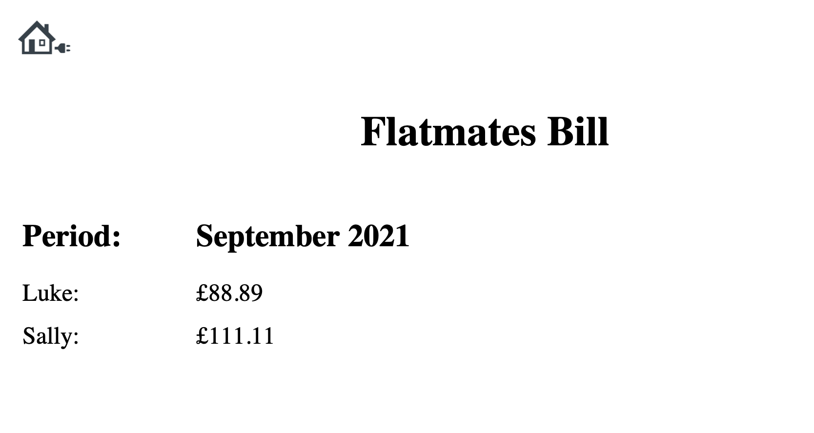

# Flatmates Bill

A Python application to calculate a bill shared between 2 flatmates, depending on the number of days spent in the flat. The result is saved in a PDF report.

```
$ python main.py
Enter bill amount: 200
Enter the bill period: September 2021
Enter the name of the first flatmate: Luke
How many days did Luke spend in house? 20
Enter the name of the second flatmate: Sally
How many days did Sally spend in house? 25
Luke pays: £ 88.89
Sally pays: £ 111.11
```

---



